# Guia de Uso

> [Read in English](GUIDE_OF_USE.md)

Esta guia te lleva paso a paso por el flujo completo del Real Estate Finance Planner, desde crear un escenario hasta interpretar los resultados del analisis.

## Requisitos Previos

Asegurate de que la aplicacion esta corriendo:

```bash
docker compose up --build
```

Luego abre **http://localhost:4200** en tu navegador.

---

## Paso 1: Lista de Escenarios (Pagina Principal)

Al abrir la aplicacion por primera vez, veras la lista de escenarios. Si no hay ninguno, veras un estado vacio con un boton **+ Nuevo Escenario**.

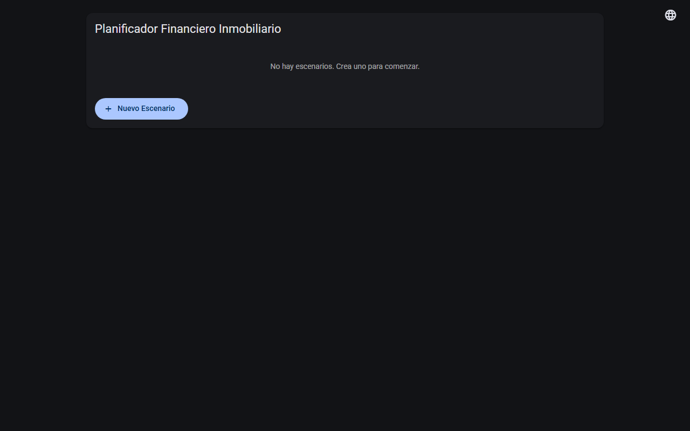

Haz clic en **+ Nuevo Escenario** para empezar.

---

## Paso 2: Crear un Nuevo Escenario

Se abrira el editor de escenarios. Empieza escribiendo un nombre descriptivo en el campo superior (ej: "Mi Primer Analisis Inmobiliario").

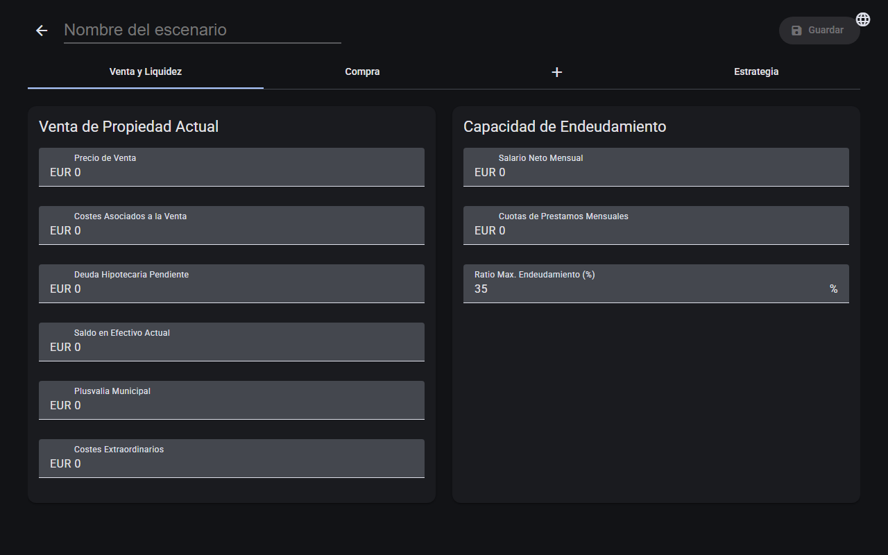

El editor esta organizado en **pestanas**:
- **Venta y Liquidez** - Datos de venta de tu propiedad actual
- **Compra** - Datos de compra de la nueva propiedad
- **Pestanas de bancos** - Una pestana por oferta bancaria (se anaden dinamicamente)
- **Estrategia** - Parametros de estrategia de inversion
- **Resultados** - Aparece tras ejecutar el analisis

---

## Paso 3: Rellenar Datos de Venta y Liquidez

En la pestana **Venta y Liquidez**, rellena dos secciones:

### Venta de Propiedad Actual
| Campo | Descripcion | Ejemplo |
|-------|-------------|---------|
| Precio de Venta | Precio esperado de venta de tu propiedad actual | 320.000 |
| Costes Asociados a la Venta | Gastos de agencia, reformas u otros costes de venta | 310.000 |
| Deuda Hipotecaria Pendiente | Hipoteca pendiente de la propiedad que vendes | 95.000 |
| Saldo en Efectivo Actual | Tus ahorros actuales / efectivo disponible | 45.000 |
| Plusvalia Municipal | Plusvalia municipal (estimacion de tu ayuntamiento) | 1.800 |
| Costes Extraordinarios | Cualquier otro coste puntual | 0 |

### Capacidad de Endeudamiento
| Campo | Descripcion | Ejemplo |
|-------|-------------|---------|
| Salario Neto Mensual | Tu salario neto mensual | 3.200 |
| Cuotas de Prestamos Mensuales | Cuotas mensuales de prestamos existentes (coche, personal) | 800 |
| Ratio Max. Endeudamiento (%) | Porcentaje maximo de ingresos destinado a deuda | 35 |

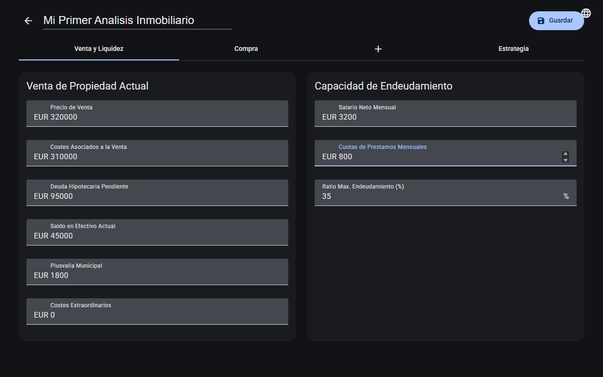

---

## Paso 4: Rellenar Datos de Compra

Haz clic en la pestana **Compra**. Rellena los detalles de la propiedad que quieres comprar:

| Campo | Descripcion | Ejemplo |
|-------|-------------|--------|
| Precio de Compra | Precio acordado para la nueva propiedad | 280.000 |
| Precio de Escritura | Precio escriturado (base imponible para ITP) | 280.000 |
| Financiable (%) | Porcentaje que financiara el banco (normalmente 80%) | 80 |
| Edad del Comprador | Tu edad (afecta a los limites del plazo hipotecario) | 35 |
| Costes de Notaria | Gastos de notaria estimados | 900 |
| Costes Administrativos | Gastos de registro y gestion | 400 |
| Costes de Tasacion | Coste de tasacion | 350 |
| Costes de Agencia | Comision de agencia inmobiliaria (si aplica) | 0 |
| Otros Costes | Cualquier coste adicional de compra | 0 |

Casillas de verificacion:
- **Aplicar ITP Reducido** - Marca si tienes derecho al 3% de ITP (familia numerosa / discapacidad). El estandar es 6%.
- **Vivienda Habitual** - Marca si sera tu vivienda habitual.

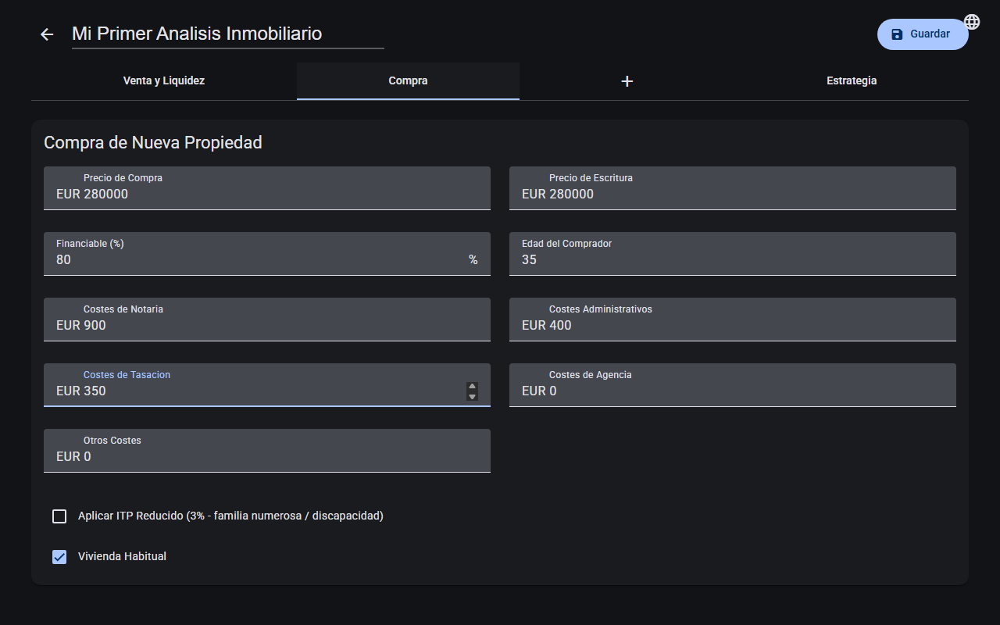

---

## Paso 5: Anadir Ofertas Bancarias

Haz clic en el boton **+** (pestana con icono de suma) para anadir un banco. Aparecera una nueva pestana llamada "Banco 1".

Rellena los datos del banco:

| Campo | Descripcion | Ejemplo |
|-------|-------------|--------|
| Nombre del Banco | Nombre del banco | Banco Santander |
| TIN Base (%) | Tipo de interes nominal base ofrecido | 2,90 |
| Plazos (anos) | Plazos hipotecarios a evaluar (separados por comas) | 15, 20, 25, 30 |

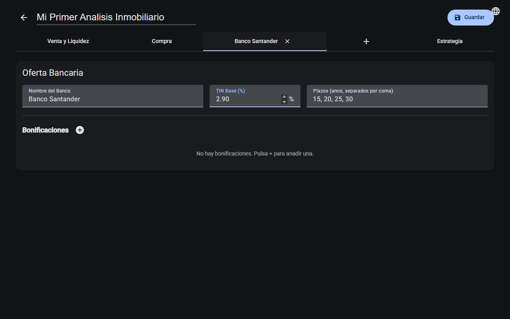

### Anadir Bonificaciones

Los bancos suelen ofrecer reducciones de tipo de interes (bonificaciones) a cambio de contratar productos adicionales. Haz clic en el boton **+** junto a "Bonificaciones" para anadir una.

Para cada bonificacion, rellena:

| Campo | Descripcion | Ejemplo |
|-------|-------------|--------|
| Nombre de Bonificacion | Nombre descriptivo | Domiciliacion de Nomina |
| Categoria | Tipo de producto | Otro |
| Reduccion TIN (%) | Cuanto se reduce el TIN | 0,50 |
| Coste Mensual | Coste mensual del producto | 0 |
| Coste Anual | Coste anual | 0 |
| Coste Unico | Coste de alta o puntual | 0 |
| Duracion (anos) | Cuanto dura la bonificacion (vacio = todo el plazo) | - |

Marca **Aceptado** si planeas aceptar esta bonificacion. Marca **Obligatorio** si el banco la exige obligatoriamente.

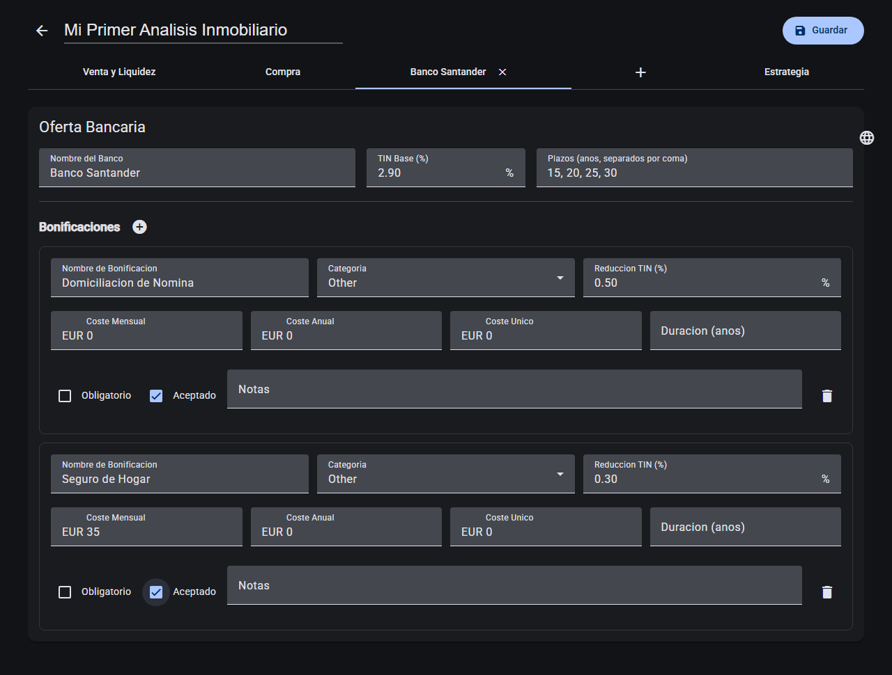

### Multiples Bancos

Puedes anadir tantos bancos como quieras haciendo clic en **+** de nuevo. Cada banco tiene su propia pestana. Esto te permite comparar ofertas lado a lado.

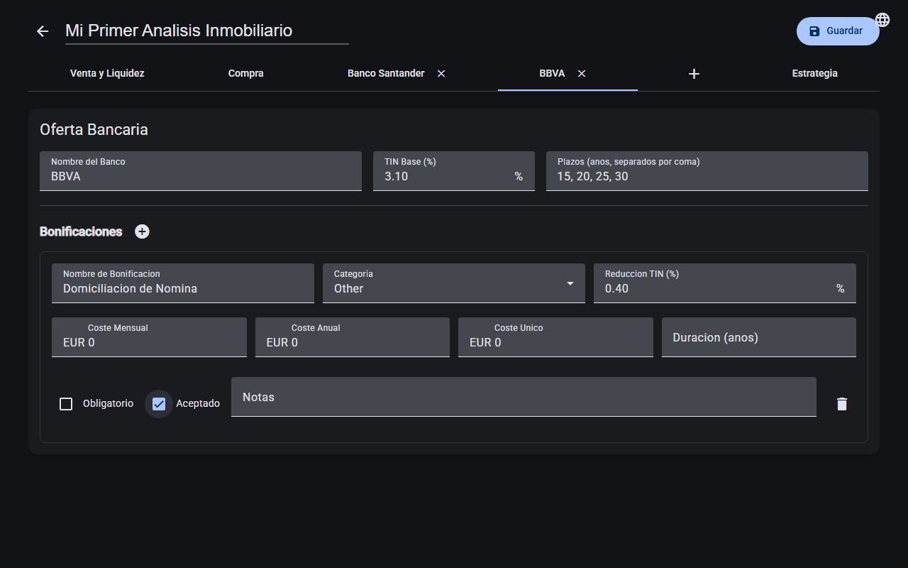

Para eliminar un banco, haz clic en la **X** de su pestana.

---

## Paso 6: Configurar Parametros de Estrategia

Haz clic en la pestana **Estrategia** para configurar los parametros de comparacion de inversiones:

| Campo | Descripcion | Ejemplo |
|-------|-------------|--------|
| Rentabilidad Conservadora (%) | Rentabilidad anual pesimista de la inversion | 3 |
| Rentabilidad Base (%) | Rentabilidad anual esperada de la inversion | 6 |
| Rentabilidad Optimista (%) | Rentabilidad anual en el mejor caso | 9 |
| Horizonte de Analisis (anos) | Periodo de tiempo para la comparacion | 20 |
| Colchon Minimo de Liquidez | Reserva de efectivo que quieres mantener disponible | 15.000 |
| Capital Adicional a Preservar | Capital extra no disponible para inversion | 0 |
| Perfil de Riesgo | Tu tolerancia al riesgo (Conservador / Equilibrado / Agresivo) | Equilibrado |
| Usar Rentabilidad Neta | Si las tasas de retorno son despues de impuestos | Si |

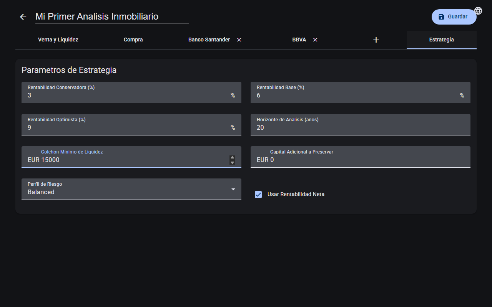

---

## Paso 7: Guardar el Escenario

Haz clic en el boton **Guardar** en la esquina superior derecha. Aparecera un mensaje de confirmacion "Escenario guardado". Tras guardar, el boton **Ejecutar Analisis** estara disponible.

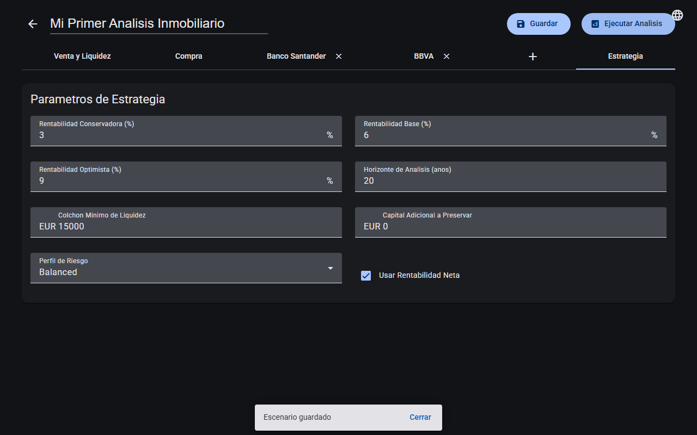

> Puedes guardar en cualquier momento y volver mas tarde para seguir editando.

---

## Paso 8: Ejecutar el Analisis

Haz clic en **Ejecutar Analisis**. El sistema calculara:
- Liquidez por venta (efectivo neto tras vender tu propiedad actual)
- Costes de compra (ITP, notaria, entrada, etc.)
- Opciones hipotecarias para cada banco y cada plazo
- Evaluacion coste/beneficio de bonificaciones
- Comparacion de estrategias (amortizar mas rapido vs. mantener capital)

Aparecera una pestana "Resultados" cuando el analisis termine.

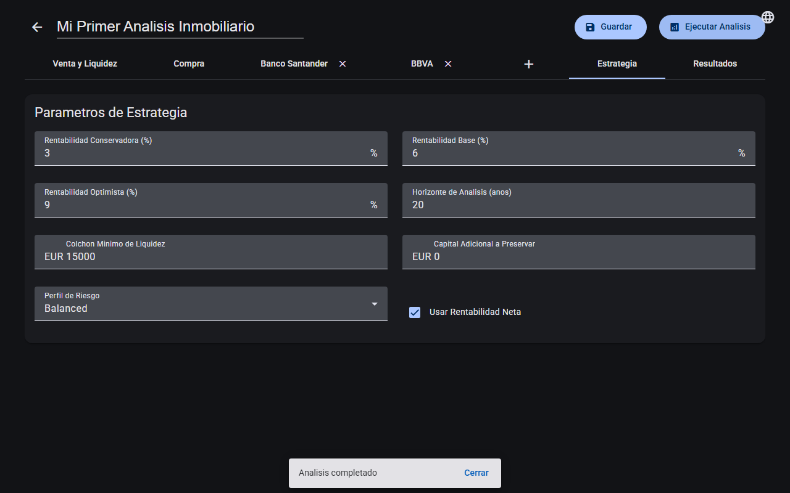

---

## Paso 9: Interpretar los Resultados

Haz clic en la pestana **Resultados** para ver el analisis completo. Los resultados se dividen en secciones:

### Venta y Liquidez
Muestra el efectivo neto disponible tras vender tu propiedad actual y pagar todas las deudas.

### Costes de Compra
Muestra ITP, hipoteca maxima, entrada, efectivo total necesario, liquidez restante y si la operacion es viable.

### Comparacion de Bancos
Para cada banco veras:
- **Insignia de recomendacion**: Recommended / NotWorthIt
- **Desglose de TIN**: TIN Base, TIN Max. con Descuento, TIN Real Final
- **Tabla de opciones hipotecarias**: Para cada plazo (15, 20, 25, 30 anos) - cuota mensual, total pagado, intereses totales, ratio de deuda, efectivo libre
- **Evaluaciones de bonificaciones**: Si cada bonificacion te ahorra o te cuesta dinero, con un indicador visual

### Comparacion de Estrategias
Compara dos enfoques:
- **Amortizar Mas Rapido**: Usar todo el efectivo disponible como entrada para minimizar la hipoteca
- **Mantener Capital**: Usar la financiacion estandar e invertir la diferencia

Muestra diferencias netas bajo escenarios conservador, base y optimista, con una recomendacion ponderada.

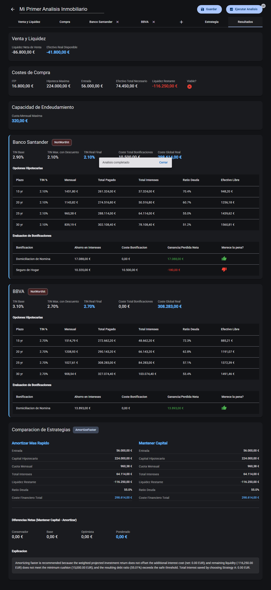

---

## Paso 10: Volver a la Lista de Escenarios

Haz clic en la **flecha atras** (arriba a la izquierda) para volver a la lista de escenarios. Tu escenario aparecera con una marca verde en la columna "Analizado".

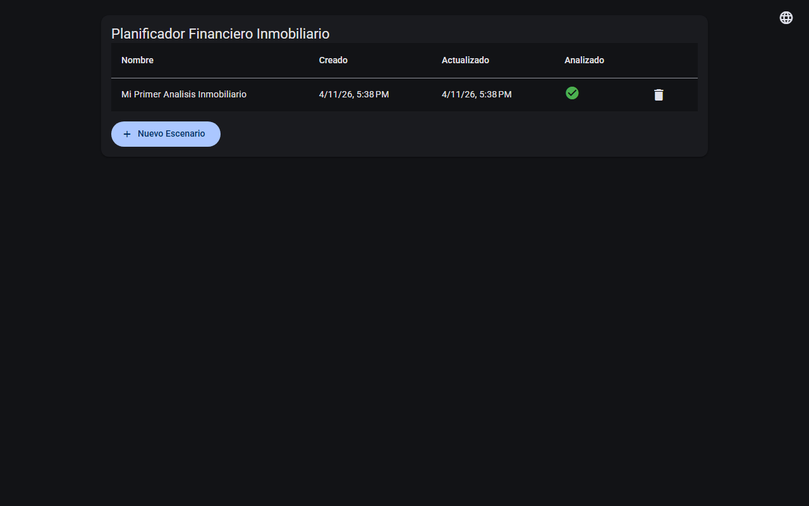

Desde aqui puedes:
- **Hacer clic en un escenario** para reabrirlo y editarlo
- **Eliminar un escenario** con el icono de papelera
- **Crear mas escenarios** para comparar diferentes propiedades o condiciones

---

## Consejos

- **Guarda a menudo**: Puedes guardar datos parciales y volver mas tarde.
- **Compara bancos**: Anade 2-3 ofertas bancarias para ver cual te da la mejor condicion.
- **Prueba diferentes estrategias**: Cambia el perfil de riesgo y las tasas de retorno para ver como cambia la recomendacion.
- **Ajusta el colchon de liquidez**: Un colchon mayor es mas seguro pero reduce el capital disponible para amortizacion o inversion.
- **Vigila el ratio de endeudamiento**: Si supera tu maximo (normalmente 35%), la operacion puede no ser viable. Considera un plazo hipotecario mas largo o una propiedad mas economica.

---

## Documentacion de la API

La API del backend esta documentada con Scalar en **http://localhost:5000/scalar/v1**. Puedes usarla para integrar con otras herramientas o probar endpoints directamente.
